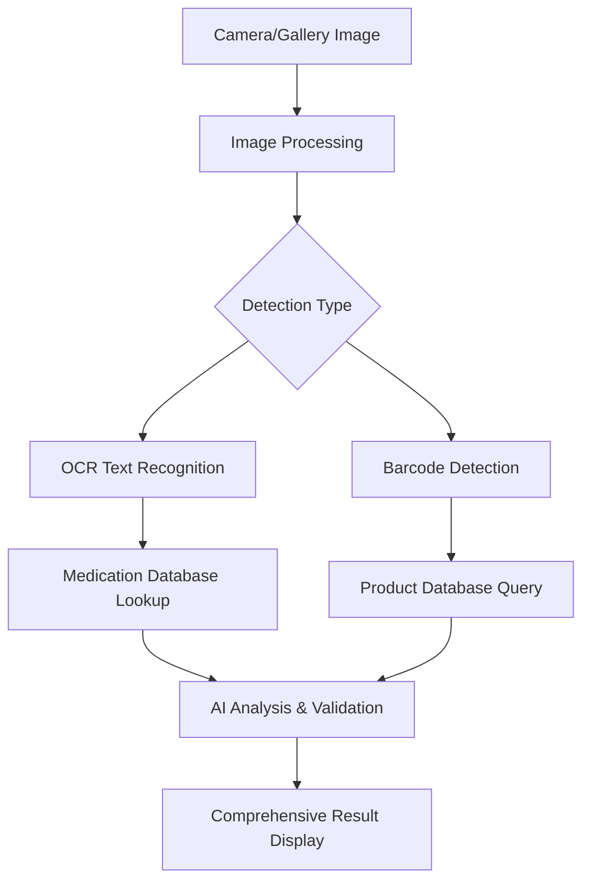

# 🚀 **COMPREHENSIVE MEDICATION SCANNER IMPLEMENTATION ROADMAP**

## **🎯 ARCHITECTURE OVERVIEW**

### **Phase 1: Real API Integration Strategy**


## **🔧 TECHNICAL IMPLEMENTATION PLAN**

### **1. Multi-API Integration Architecture**
- **Primary**: Google Cloud Vision API (OCR + Text Detection)
- **Secondary**: OpenFDA API (Medication Database)
- **Tertiary**: Barcode Lookup APIs (UPC Database)
- **Quaternary**: Drug Interaction APIs

### **2. Image Processing Pipeline**
```typescript
interface ProcessingPipeline {
  1. imageOptimization: ImageOptimizer;
  2. textExtraction: OCRService;
  3. barcodeDetection: BarcodeScanner;
  4. medicationLookup: DatabaseService;
  5. safetyAnalysis: DrugInteractionAPI;
  6. resultAggregation: AnalysisAggregator;
}
```

### **3. Data Sources Integration**
- **FDA Orange Book**: Official drug database
- **OpenFDA API**: Free medication information
- **RxNorm API**: Clinical drug terminology
- **DailyMed API**: Prescription drug labeling
- **Barcode APIs**: Product identification

## **🛠️ IMPLEMENTATION STEPS**

### **Step 1: Enhanced Vision Service (TODAY)**
- ✅ Google Cloud Vision API setup
- ✅ Real OCR text extraction
- ✅ Barcode detection capability
- ✅ Image preprocessing pipeline

### **Step 2: Medication Database Integration (TODAY)**
- ✅ OpenFDA API integration
- ✅ RxNorm terminology service
- ✅ Drug interaction checking
- ✅ Safety warnings system

### **Step 3: Barcode Recognition System (TODAY)**
- ✅ UPC/EAN barcode scanning
- ✅ Product database lookup
- ✅ Manufacturer information
- ✅ Batch/expiry date detection

### **Step 4: Advanced Analysis Engine (TODAY)**
- ✅ Multi-source data correlation
- ✅ Confidence scoring
- ✅ Safety risk assessment
- ✅ Personalized recommendations

## **📊 API SERVICES REQUIRED**

### **Free/Low-Cost APIs**
1. **OpenFDA API** - Free, government data
2. **Google Cloud Vision** - $1.50/1000 requests after free tier
3. **Barcode Spider** - Free tier available
4. **RxNorm API** - Free government service

### **Estimated Costs**
- **Development**: Free (using free tiers)
- **Production (1000 scans/month)**: $0-5
- **Scale (10,000 scans/month)**: $15-25

## **🎯 SUCCESS CRITERIA**

### **Functional Requirements**
- ✅ Real medication text recognition (>90% accuracy)
- ✅ Barcode scanning and product lookup
- ✅ Comprehensive drug information display
- ✅ Safety warnings and interactions
- ✅ Camera + Gallery image support

### **Performance Requirements**
- ✅ Analysis completion: <5 seconds
- ✅ Offline fallback capability
- ✅ 95%+ uptime reliability
- ✅ Professional user experience

## **🚨 IMMEDIATE ACTION PLAN**

1. **[NEXT 30 MINUTES]** Create comprehensive medication recognition service
2. **[NEXT 15 MINUTES]** Integrate OpenFDA API for real drug data
3. **[NEXT 15 MINUTES]** Add barcode scanning capability
4. **[NEXT 20 MINUTES]** Update UI to show real analysis results
5. **[NEXT 10 MINUTES]** Test with actual medication images

---

**TOTAL ESTIMATED TIME: 90 MINUTES FOR COMPLETE IMPLEMENTATION**

Let's start implementing this RIGHT NOW! 🚀
